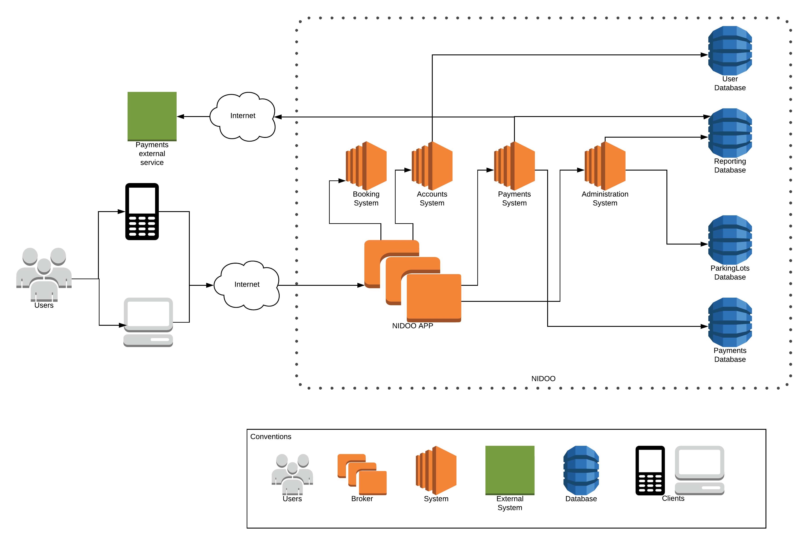
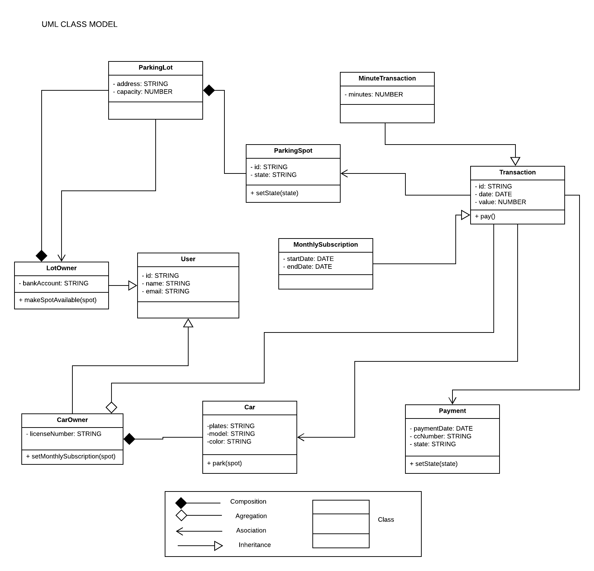
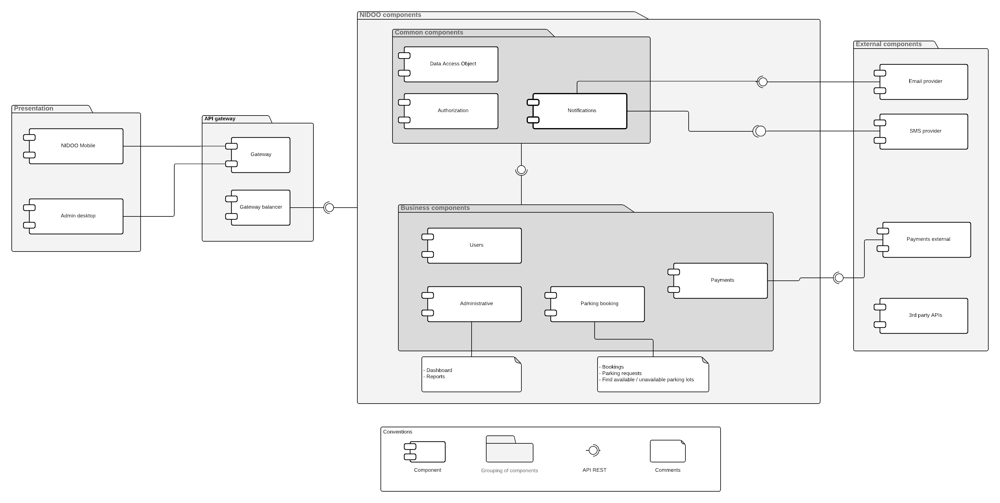
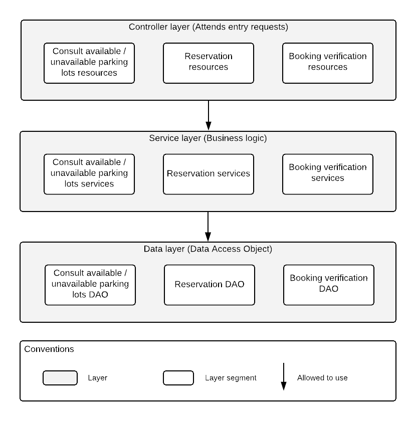
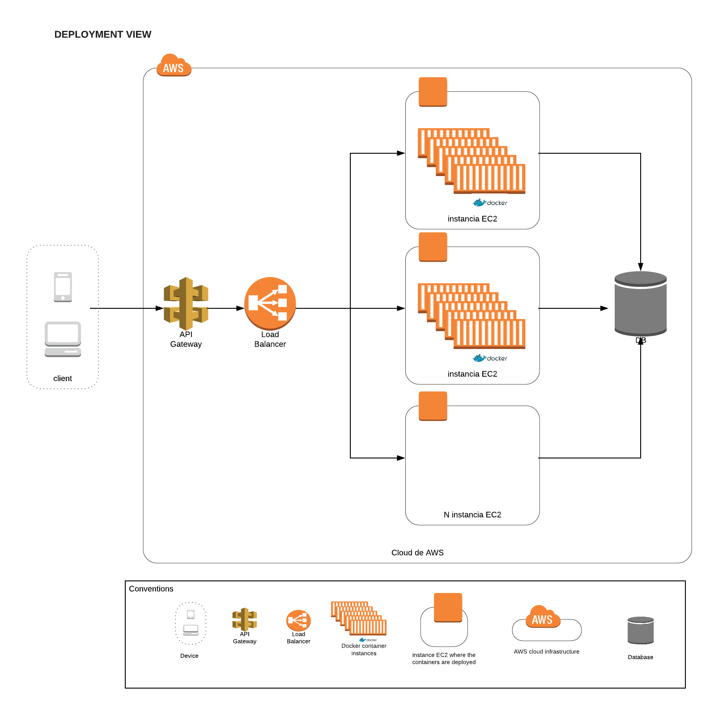

# Arquitectura

El desarrollo de este proyecto se basa en una arquitectura de microservicios, la cual permite tener componentes pequeños, simples y desacoplados, lo que a su ves permite tener aplicaciones escalables, flexibles y reutilizables.

## Microservicios con contenedores

Esta decisión de arquitectura permite construir componentes ligeros que procesen un alto volumen transaccional utilizando tecnologías ligeras.

- Beneficios:
    - Autonomía: Si se cae un microservicio no se caen los demás.
    - Desempeño: Al distribuirse la carga a través de los microservicios.
    - Aislamiento: Uso de contenedores Docker implementando portabilidad, versionamiento e independencia de proveedores.
    - Reutilización: Creación de componentes por separado. Habilita la modificabilidad de la solución.
    - Segregación de responsabilidades: Cada componente implementa una funcionalidad específica.

## Modelo de contexto

La siguiente vista muestra los sistemas de los cuales está compuesto NIDOO, los sistemas externos y usuarios que interactuan con esos sistemas.

NIDOO como sistema cumplirá con funcionalidades como registro de usuarios, registro y solicitus de parqueaderos, servicio de pagos, entre otros. Los sistemas externos cumplen la funcionalidad de potenciar funcionalidades de NIDOO; son sistemas que ya han sido implementados, probados y con tiempo de vida en el mercado, ejemplos son los sistemas de pagos, centrales de riesgo, sistemas de seguridad, entre otros.

## Modelo de dominio del problema

La siguiente vista nos muestra las entidades más importantes del sistema y las relaciones que existen entre estas.

## Modelo de componentes

### Vista componentes nivel 0

La siguiente vista de componentes muestra a un alto nivel cada uno de los microservicios y como se dividen en responsabilidades.

1. **Presentacion:**
Contiene las aplicaciones web y mobile donde estará la interfaz de usuario y se comunicarán mediante peticiones REST a los servicios de NIDOO, estas peticiones se realizarán a los componentes de lógica de negocio. Estilo de arquitectura utilizado: cliente - servidor.

2. **API Gateway:**
* El componente de API Gateway es un recurso del tipo plataforma como servicio PaaS que enlaza las APIs implementadas en los microservicios.
* El API gateway incluye el balanceador de aplicación como servicio enrutando las peticiones al microservicio más saludable, teniendo en cuenta el uso de recurso de procesador, peticiones por segundo o por la memoria consumida.
* Este servicio está basado en el estilo de arquitectura Broker, el cual es el encargado de ser el intermediario entre los clientes y los servicios sin importar su ubicación y además del balanceo de recursos.

3. **Componentes de negocio:**
Representa todos los microservicios encargados de la ejecución de los procesos de negocio, cada uno con responsabilidades definidas. El estilo de arquitectura utilizado es SOA:

    - Users: Microservicio encargado del manejo de los usuarios del sistema, como creación, modificación, administración.
    - Administrative: Se encarga de toda la parte administrativa de la aplicación junto con todo el manejo de reportes y el manejo del Dashboard para la administración de parqueaderos.
    - Parking booking: Este microservicio se encarga del core del negocio como busqueda de parqueaderos, solicitud de parqueo, etc.
    - Payments: Microservicio encargado de toda la parte de pagos dentro del sistema, incluye tambien la comunicacion con componentes de pagos externos.

4. **Componentes comunes:**
Estos componentes comprenden todo aquello común dentro de la aplicacion, como temas de notificaciones, acceso a base de datos y autenticacion. De la misma manera que los componentes de negocio, el estilo de arquitectura utilizado es SOA.

5. **Componentes externos:**
Los componentes externos, son todas aquellas aplicaciones o componentes que están fuera de la frontera del sistema pero debe existir una comunicacion ya sea de consumo o exposición.

### Vista componentes nivel 1

La siguiente vista muestra la estructura de un microservicio, la cual se utiliza un estilo en capas, como se muestra en la imagen a continuación:

Esta vista representa el componente **Parking booking**.

## Modelo de despliegue

La vista a continuación muestra el despliegue de los microservicios dentro de contenedores Docker los cuales a su vez se encuentran dentro de instancias EC2 en AWS. 

Las aplicaciones web y mobile se comunican a traves de un API Gateway, el cual usando un balanceador de carga, distribuye las peticiones a cada una de las instancias EC2.

El estilo de arquitectura utilizado es multi-tier, aqui se pueden ver los componentes funcionales de la solución junto con los componentes hardaware necesarios para su funcionamiento.

[Volver al inicio](index.md)
